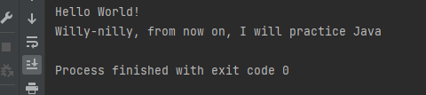

# I. Introduction

Java application that implements the following operations:

## 1. Compulsory

- [x] a. Display on the screen the message "Hello World!". Run the application. If it works, go to step 2 :)
- [x] b. Define an array of strings languages, containing {"C", "C++", "C#", "Python", "Go", "Rust", "JavaScript", "PHP", "Swift", "Java"}
- [x] c. Generate a random integer n: int n = (int) (Math.random() * 1_000_000);
- [x] d. Compute the result obtained after performing the following calculations:
  - [x] i. multiply n by 3;
  - [x] ii. add the binary number 10101 to the result;
  - [x] iii. add the hexadecimal number FF to the result;
  - [x] iv. multiply the result by 6;
- [x] e. Compute the sum of the digits in the result obtained in the previous step. This is the new result. While the new result has more than one digit, continue to sum the digits of the result.
- [x] f. Display on the screen the message: "Willy-nilly, from now on, I will practice " + languages[result].

#### Proof :

[Work](src/Introduction/Compulsory.java)

## 2. Optional

- [x] a. Let n, p be two integers and C1,...,Cm a set of letters (the alphabet), all given as a command line arguments. Validate the arguments!
- [x] b. Create an array of n strings (called words), each word containing exactly p characters from the given alphabet.
- [x] c. Display on the screen the generated array.
- [ ] d. Two words are neighbors if they have a common letter.
- [ ] e. Create a boolean n x n matrix, representing the adjacency relation of the words.
- [ ] f. Create a data structure (using arrays) that stores the neighbors of each word. Display this data structure on the screen.
    - [ ] i. For larger n display the running time of the application in nanoseconds (DO NOT display the data structure!). Try n > 30_000. You might want to adjust the JVM Heap Space using the VM options -Xms4G -Xmx4G.
- [ ] g. Launch the application from the command line, for example: java Lab1 100 7 A C G T.

#### Proof :

## 3. Bonus

- [ ] a. Implement an efficient algorithm that determines, if possible, a subset of distinct words W1,W2,...,Wk (from the ones that you have generated) such that k ≥ 3 and Wi and Wi+1 are neighbors, for all i in [1..k], where Wk+1=W1.
- [ ] b. Can you find the largest possible k?

#### Proof :
