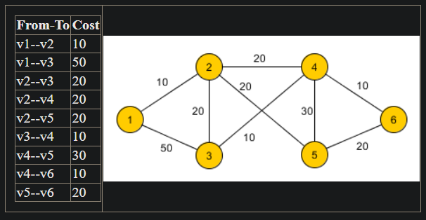
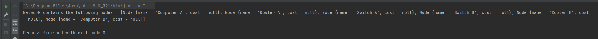

# III. The Network Routing Project

A network contains various nodes, such as computers, routers, switches, etc.  Nodes in the network have unique names and may have other common properties such as hardware (MAC) address, the location on a map, etc.
 Some of them are identified using an IP-address. Some of them are able to store data, having a storage capacity, expressed in gigabytes (GB).
 The time (measured in milliseconds) required for a network packet to go from one node to another is known.
  Example: locations are: v1 (Computer A) v2 (Router A) v3 (Switch A) v4 (Switch B) v5 (Router B) v6 (Computer B).
  
  
Computers and routers are identified by IPs, while only computers are able to store data.
  
The main specifications of the application are:

## 1. Basic requirements

- [x] a. Create an object-oriented model of the problem. You should have at least the following classes Network, Node, Computer, Router, Switch. The natural ordering of the nodes is given by their names.
- [x] b. Create the interfaces Identifiable and Storage. The classes above must implement these interfaces accordingly.
- [x] c. The Network class will contain a List of nodes.
- [x] d. Create and print all the nodes in the network (without the time costs).

#### Proof :

## 2. Expanding and reworking features

- [x] a. Each node will contain a Map representing the time costs. Create and print the complete network in the example.
- [ ] b. Create a default method in the interface Storage, that is able to return the storage capacity in other units of storage (megabyte, kilobyte, byte).
- [ ] c. In the Network class, create a method to display the nodes that are identifiable, sorted by their addresses.
- [ ] d. Implement an efficient algorithm to determine all the shortest times required for data packets to travel from an identifiable node to another.

#### Proof :

## 3. Advanced features

- [ ] a. In addition to the time cost, each link between two network nodes has a probability of failure. You may want to read <a href=https://profs.info.uaic.ro/~olariu/curent/AG/files/ag3.pdf>this</a>.
- [ ] b. Implement an efficient algorithm to determine the safest route for a packet to travel between two given nodes.
- [ ] c. Generate random network instances with known optimum and test your algorithm using JUnit or other framework.

#### Proof :
