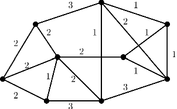

# IV. Roads & Intersections Project

A city hall wants to install surveillance cameras at all intersections in a city.
 To do this, it must connect all intersections with data cables, along the streets between them, such that the resulting network is connected.
 We assume that the lengths (in km) of the streets between all the intersections of the city are known and the costs of installing the cables is proportional with the street lengths.
 The problem is to determine how to install the data cables (on which streets) such as the total cost is minimum.

Example (the dots are the intersections, the lines are the streets)
 

The main specifications of the application are:

## 1. Basic requirements

- [x] a. Create a Maven project.
- [x] b. Create an object-oriented model of the problem. Streets have names and lengths, intersections have names. A street joins two intersections.
- [x] c. Create the streets and the intersections of the problem described in the example. Use streams in order to easily create the intersections.
- [x] d. Create a list of streets, using LinkedList implementation and sort it by the length, using a comparator expressed as a lambda-expression or method reference. Make sure all the objects are comparable.
- [x] e. Create a set of intersections, using a HashSet implementation. Verify the property that a Set does not contain duplicates.

#### Proof :

## 2. Expanding and reworking features

- [x] a. Create a class that describes the city.
- [ ] b. Using Java Stream API, write a query that display all the streets that are longer than a specified value and join at least 3 streets.
- [ ] c. Use a third-party library in order to generate random fake names for intersections and streets.
- [ ] d. You may use this package of JGraphT in order to solve the problem (or other library).

#### Proof :

## 3. Advanced features

- [ ] a. The city hall wants to regularly inspect the surveillance cameras, sending a maintenance car to go through it all.
- [ ] b. Implement an algorithm that determines the route of the maintenance car, in order to minimize the total length. The algorithm must run fast and should not find a solution that is twice as bad than the optimum route.
- [ ] c. Create a random problem generator, making sure that the lengths between intersections satisfy the triangle inequality.

#### Proof :

