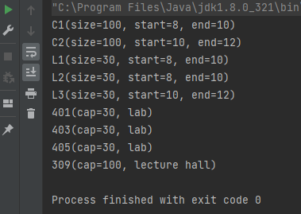

# II. The Room Assignment Project

An instance of the Room Assignment Problem consists of events and rooms. Events may be courses, labs, seminars, etc. Rooms may be lecture halls, computer labs, etc.

Each event has a name, a number of participants (its size), a start time and an end time.
Each room has a name, a type and a capacity.
We consider the problem of assigning a room to each event such that the constraints are satisfied and the number of used rooms is as small as possible (if possible).

Consider the following example.
  
Events:   C1(size=100, start=8, end=10), C2(size=100, start=10, end=12), L1(size=30, start=8, end=10), L2(size=30, start=8, end=10), L3(size=30, start=10, end=12),
  
Rooms:   401(cap=30, lab), 403(cap=30, lab), 405(cap=30, lab), 309(cap=100, lecture hall)
 
A solution may be something like that:
 
 C1 -> 309
 C2 -> 309
 L1 -> 401
 L2 -> 403
 L3 -> 401
  
The main specifications of the application are:

## 1. Basic requirements

- [x] a. Create an object-oriented model of the problem. You should have (at least) the following classes: Event, Room.
  The start and end time will be integers. The rooms will also have the property type. The available types will be implemented as an enum .
- [x] b. Each class should have appropriate constructors, getters and setters.
- [x] c. The toString method form the Object class must be properly overridden for all the classes.
- [x] d. Create and print on the screen the objects in the example.

#### Proof :

## 2. Expanding and reworking features

- [x] a. Create a class that describes an instance of the problem.
- [x] b. Override the "equals" method form the Object class for the Event, Room classes. The problem should not allow adding the same event or room twice.
- [x] c. Instead of using an enum, create dedicated classes for lecture halls and computer labs. Room will become abstract. The course room may have an additional property indicating if there is a video projector, and the lab room may indicate the operating system of its computers.
- [ ] d. Create a class to describe the solution.
- [ ] e. Implement a simple algorithm for creating a feasible solution to the problem, "trying" to minimize the number of used rooms.
- [ ] f. Write doc comments in your source code and generate the class documentation using javadoc.

#### Proof :

## 3. Advanced features

- [ ] a. Use the time package in order to describe the start and the end time of the events.
- [ ] b. Implement the "DSatur" graph coloring algorithm.
- [ ] c. Generate large random instances and:
  - [ ] compare the solutions generated by Greedy and "DSatur" algorithms;
  - [ ] analyze the performance of your algorithm (running times, memory consumption). Identify the hot-spots in your code.

#### Proof :
